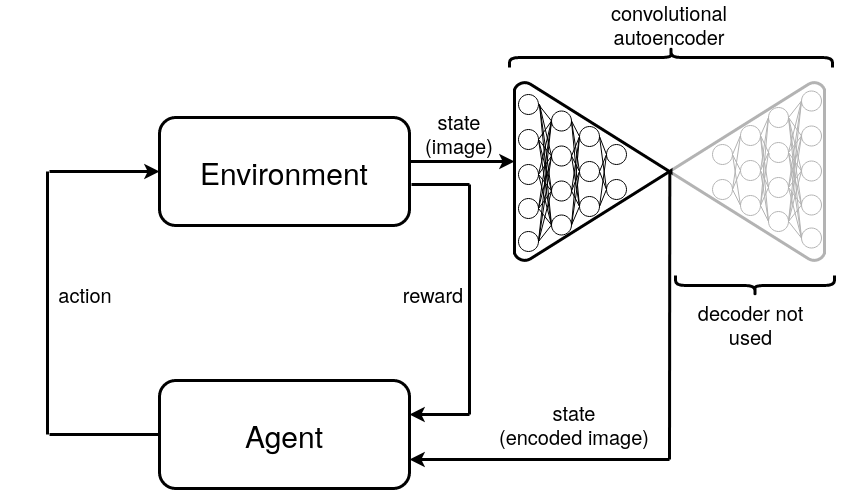
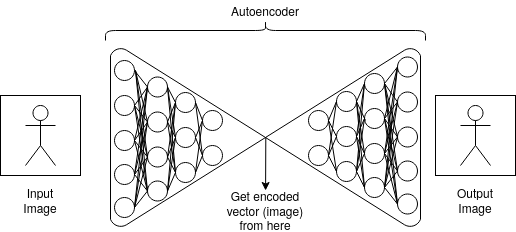
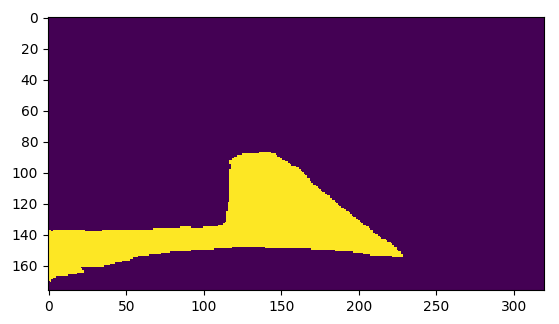
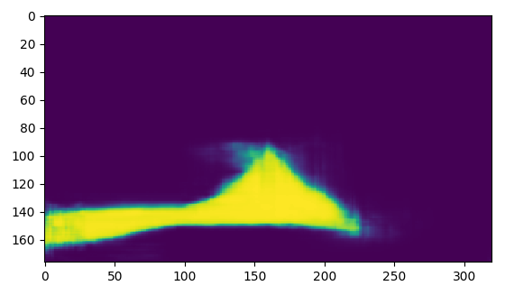

# Soft Actor Critic For Simple Car Game


For more information about the game check out [**Simple car game for reinforcement learning**](https://github.com/MatthiasSchinzel/Simple-Car-Game-For-Reinforcement-Learning). Unlike most other SAC games this implementation is relying on images instead if distance vectors as input to the network. For reducing the image dimension an Autoencoder is used. This is an example on how to use the simple car game with a reinforcement learning algorithm.

## 1. Getting Started

Maybe you want to play the game first manually to get a feeling for the game itself (1.2).  
Inside the folder SavedWeights you can find pretrained parameters for the autoencoder and the policy network.

### 1.1. Requirements

The game itself needs
```
pip install numpy pygame opencv-python
```
The SAC implementation is using [**pytorch**](https://pytorch.org/) and the Autoencoder is using [**tensorflow**](https://www.tensorflow.org/install)
```
pip install torch torchvision
```
```
pip install tensorflow
```
(Sorry you need to install both.)

### 1.2. Play the game manually

The game can be played manually using W,A,S,D for steering. Hit E to engage the 'autopilot' (policy network) and R to disable it. With Q you can quit the game.


### 1.3. Train your own SAC

In order to train the SAC by yourself, just check out TrainSoftActorCritc.ipynb. One nice thing is, that you can check the current process by using playing the game manually using the last saved weights of the policy function.  
What is really important is, that you design your loss function inside the game so it suits your needs. For example, I did quite some experiments to get the car going straight without shaking and wiggling around too much.


## 2. Technical details

The environment is outputting and image which is reduced in dimensions to 55 by a convolutional autoencoder. Appended to the actual state are the last two actions that were given by the agent. This is done to control the shakiness of the driving - the environment is penalizing shaky driving based on the past actions. Hence, the agent receives a vector with 59 entries.  


### 2.1. Convolutional autoencoder



In order to train the SAC successfully, we need to reduce the dimensions of the image. Here I used an Autoencoder to reduce the dimension of the image. I don't want to go into the full details of the Autoencoder here, but you have an encoder and a decoder. The encoder is reducing the dimension of the image and the decoder is trying to reconstruct the image from the encoded vector. The encoded vector is what we are interested in for using SAC. The decoder is just used for training, to get a somehow meaningful encoded vector.

Here an example Image of the used Autoencoder:

Input image             |  Output image
:-------------------------:|:-------------------------:
  |  

Note that we have binary images here. You can of course increase the dimension of the encoded vector to get a better output image. This means however also that SAC has more dimensions to explore (training of SAC will take longer and might even get unstable).

### 2.2. State vector

Inside PygamePlayCar.py you can find self.action_space, which is representing the state of the environment. self.action_space consists of the encoded vector and the past two actions given by the agent. I added the two actions, because the scoring system of the game is penalizing shaky inputs. The length of the state vector is 59.

## Authors

* [**Matthias Schinzel**](https://github.com/MatthiasSchinzel)

## License

No license yet

## Acknowledgments
* [**Check out the SAC Paper**](https://arxiv.org/abs/1801.01290)
* Thanks for the [**SAC implementation**](https://github.com/higgsfield/RL-Adventure-2)
* Hat tip to [**AtsushiSakai/PythonRobotics**](https://github.com/AtsushiSakai/PythonRobotics) where I got inspiration for the car model. You should check out this repository.
* Thanks to [**Pygame**](https://www.pygame.org)
